<div align="center">

# Invoice Optimizer

**From two raw source feeds to an approved, auditable monthly VAT invoice, with a person in control of every decision that matters.**


<picture>
  <source media="(prefers-color-scheme: dark)" srcset="docs/assets/ui/overview-glass-dark.png">
  <source media="(prefers-color-scheme: light)" srcset="docs/assets/ui/overview-glass-light.png">
  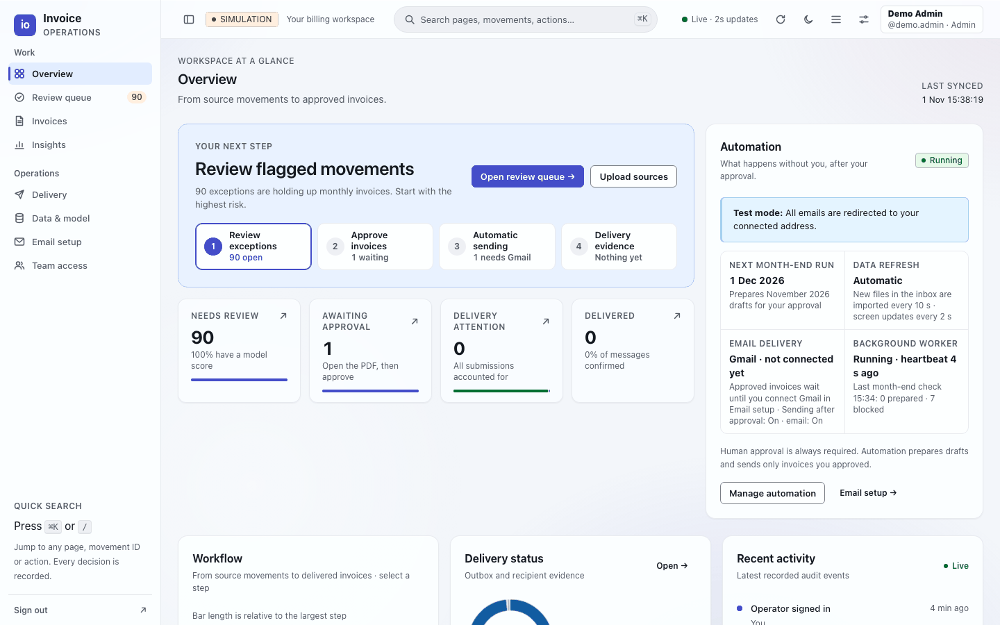
</picture>

<sub>Screenshots show synthetic fixture data. Every PDF the system renders is marked <code>SYNTHETIC DEMO / NOT A TAX INVOICE</code>.</sub>

[Quick start](#5-quick-start) ·
[Architecture](#4-architecture) ·
[Company adoption](#6-company-adoption-guide) ·
[Invoice formats](#7-customising-the-invoice-format) ·
[Insights](#8-insights-and-data-intelligence) ·
[Design system](#9-ui-and-design-system) ·
[Performance](#10-performance-and-scale-evidence)

</div>

---

## Contents

1. [What it is and why](#1-what-it-is-and-why)
2. [Highlights](#2-highlights)
3. [Screenshots](#3-screenshots)
4. [Architecture](#4-architecture)
5. [Quick start](#5-quick-start)
6. [Company adoption guide](#6-company-adoption-guide)
7. [Customising the invoice format](#7-customising-the-invoice-format)
8. [Insights and data intelligence](#8-insights-and-data-intelligence)
9. [UI and design system](#9-ui-and-design-system)
10. [Performance and scale evidence](#10-performance-and-scale-evidence)
11. [Testing and verification](#11-testing-and-verification)
12. [Project layout](#12-project-layout)
13. [Invariants and guarantees](#13-invariants-and-guarantees)
14. [Limitations and roadmap](#14-limitations-and-roadmap)
15. [Security and contributing](#15-security-and-contributing)
16. [License](#16-license)

---

## 1. What it is and why

A company that bills customers monthly for many small *movements* (purchases,
transactions, service events) usually receives them from more than one system.
Before an invoice goes out, someone has to check that the systems agree, chase
the odd ones, freeze the month, produce a correct VAT invoice, get it approved
and send it. Done by hand in spreadsheets this is slow, and it leaves no
reliable record of who decided what.

Invoice Optimizer automates the routine parts and keeps the decisions with
people:

- **Ingest** two independent source deliveries (A and B) per month from CSV,
  Parquet or XLSX, keeping the original bytes.
- **Reconcile** every movement with deterministic rules, then **score** it with
  a frozen Logistic Regression model that explains each score.
- **Queue** anything suspicious as a review case. A reviewer resolves or
  corrects it with a reason; corrections create new versions, never overwrite.
- **Prepare** the monthly invoice automatically once every movement of the
  customer-month is clean, render it with real LaTeX, and **wait for a human
  to approve the exact package** (PDF, totals, recipients, message).
- **Issue and deliver** only after approval, through a durable outbox that
  records uncertain outcomes as uncertain.

**Human in the loop, by construction.** The model can raise a concern but
cannot clear a deterministic failure. A missing score is shown as unavailable,
never as zero. No draft is ever auto-approved. An approval binds to a SHA-256
fingerprint of the package, so a changed PDF or recipient needs a new approval.
Every review, correction, approval and setting change is attributed to a
personal account and written to append-only tables.

> [!IMPORTANT]
> This release runs on a **documented synthetic contract**: GBP only, a fixed
> 20% VAT rate, `DEMO-` invoice numbers and a synthetic banner on every PDF.
> The service refuses to start unless `INVOICE_SYNTHETIC=1`. It is ready for
> evaluation and pilots; issuing real tax invoices needs the engineering listed
> in [Limitations and roadmap](#14-limitations-and-roadmap).

## 2. Highlights

<table>
<tr>
<td width="33%" valign="top">

**Auditable pipeline**<br>
Content-addressed source files, immutable movement versions, append-only
`audit_events` and `review_events` (enforced by triggers), idempotent commands
with request IDs.

</td>
<td width="33%" valign="top">

**Explainable risk model**<br>
Six row-local features, frozen scikit-learn Logistic Regression, exact
additive log-odds explanations, a what-if sandbox that never saves anything.

</td>
<td width="33%" valign="top">

**Real invoices**<br>
Jinja2-escaped LaTeX compiled by `pdflatex` without shell escape. Itemised or
summary formats, per-line VAT with an explicit rounding reconciliation.

</td>
</tr>
<tr>
<td valign="top">

**Brandable formats**<br>
Company profiles in TOML (seller, colours, font, paper, labels, logo) and
SHA-256-pinned template packs. Validate and preview from the CLI.

</td>
<td valign="top">

**Statistical insights**<br>
Supplier concentration (HHI), duplicate candidates, robust outliers, Benford,
trends, risk distribution, review ageing and data quality, in one read-only
snapshot.

</td>
<td valign="top">

**Built for big tables**<br>
Streaming ingestion, `SKIP LOCKED` job queue, keyset pagination, BRIN and
partial indexes, optional read replica, API timeouts, retention CLI.

</td>
</tr>
<tr>
<td valign="top">

**Live, light console**<br>
Vanilla JS/CSS, no framework, no remote assets. Server-Sent Events, command
palette, keyboard map, inline SVG charts.

</td>
<td valign="top">

**Design system**<br>
OKLCH tokens, six accent presets, light/dark, glass or solid surfaces,
comfortable/compact density, motion that respects reduced-motion.

</td>
<td valign="top">

**Safe by default**<br>
Personal accounts (PBKDF2, 600k iterations), read-only shared token, CSRF,
strict CSP, simulated email until you choose Gmail (test mode: every message goes only to your own connected account) or SMTP.

</td>
</tr>
</table>

## 3. Screenshots

<table>
<tr>
<td width="50%"><br><sub>Overview, light theme, glass surfaces</sub></td>
<td width="50%">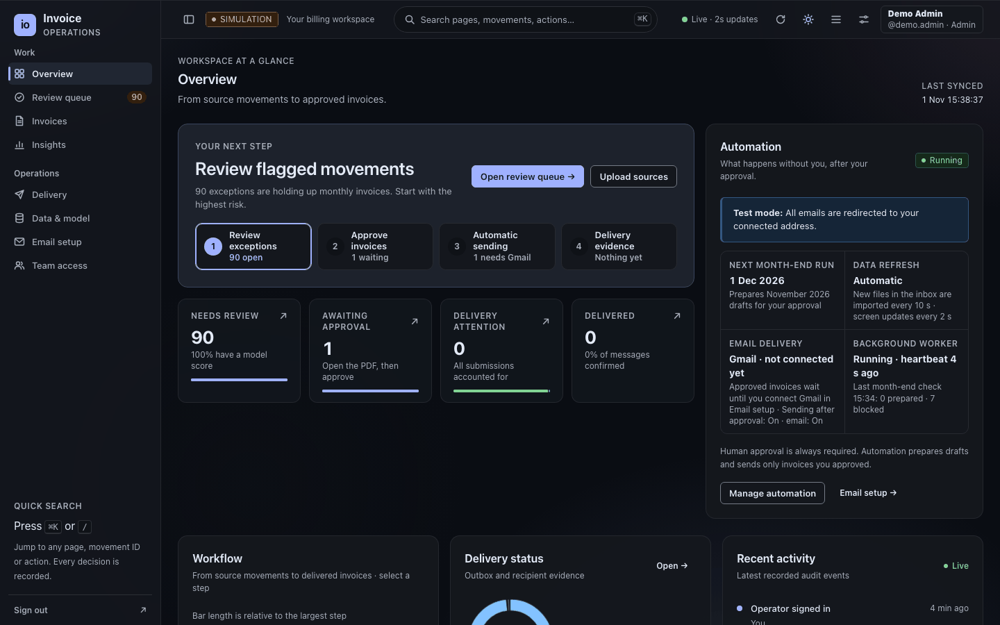<br><sub>Overview, dark theme, glass surfaces</sub></td>
</tr>
<tr>
<td>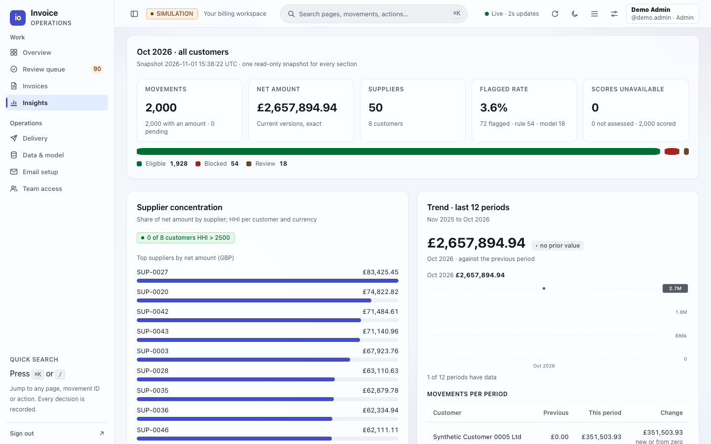<br><sub>Insights: one read-only snapshot per period</sub></td>
<td>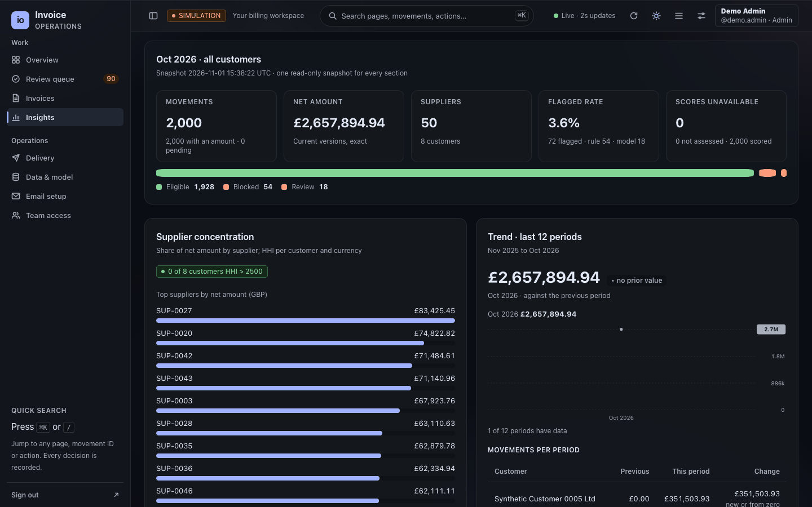<br><sub>Insights, dark theme</sub></td>
</tr>
<tr>
<td>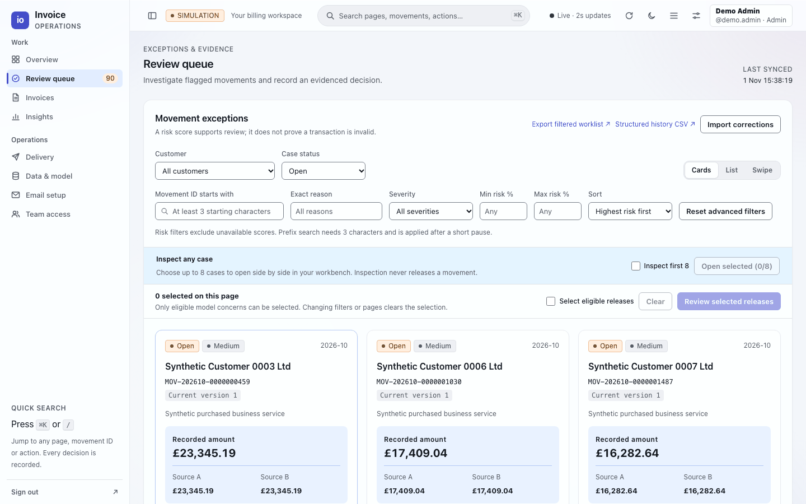<br><sub>Review queue</sub></td>
<td>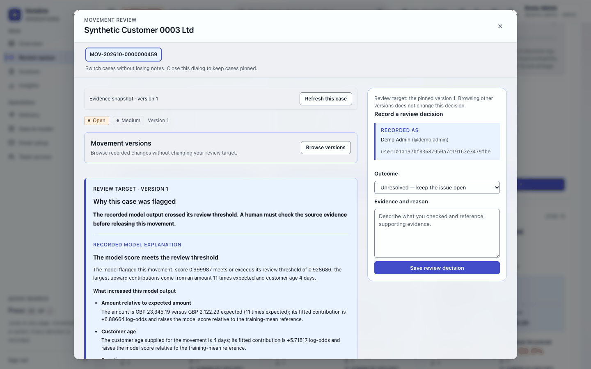<br><sub>Case workbench: why this case was flagged</sub></td>
</tr>
<tr>
<td>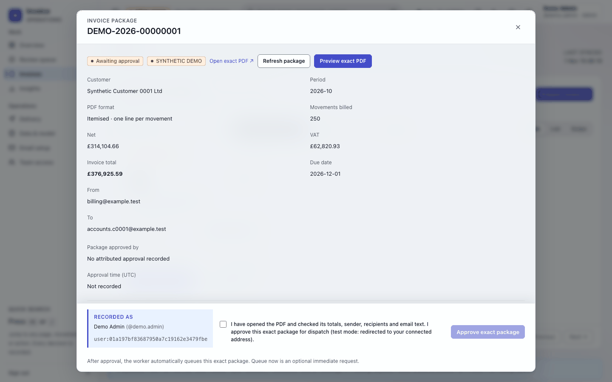<br><sub>Invoice package inspection and approval</sub></td>
<td>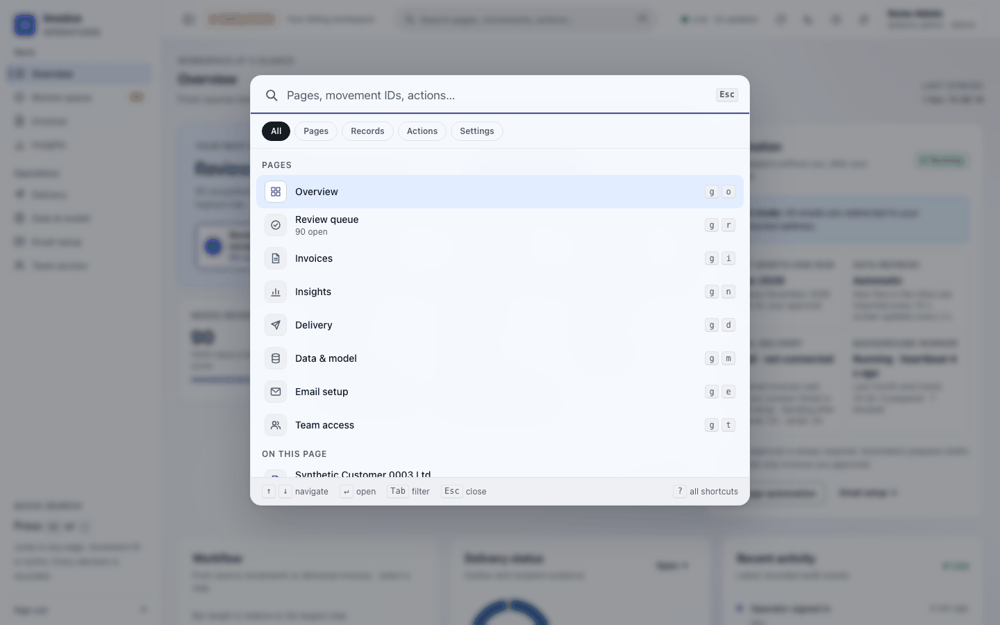<br><sub>Command palette (Cmd/Ctrl K)</sub></td>
</tr>
<tr>
<td>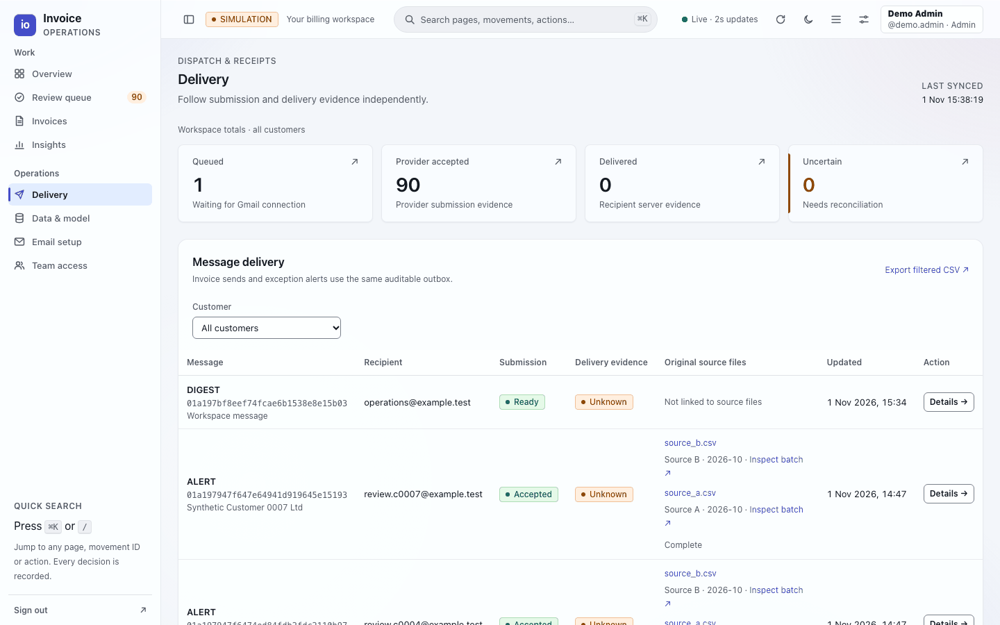<br><sub>Delivery: submission vs delivery evidence</sub></td>
<td>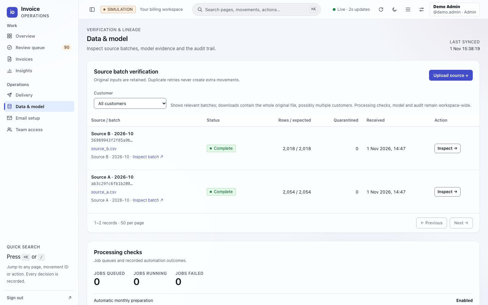<br><sub>Data & model: batches, model, worker heartbeat</sub></td>
</tr>
<tr>
<td>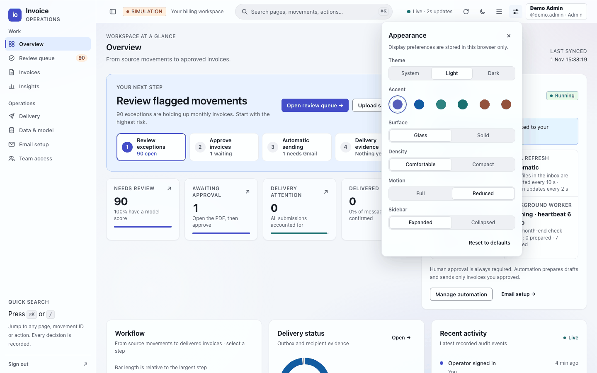<br><sub>Appearance panel</sub></td>
<td>
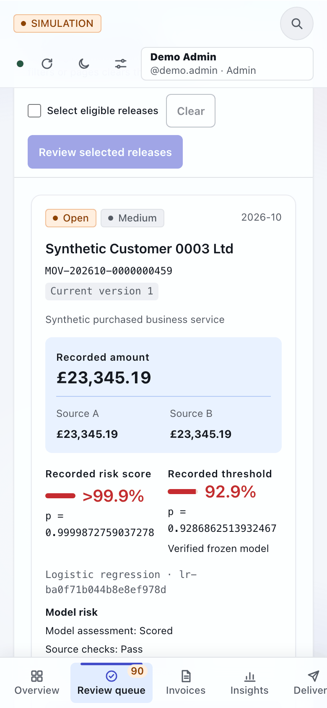
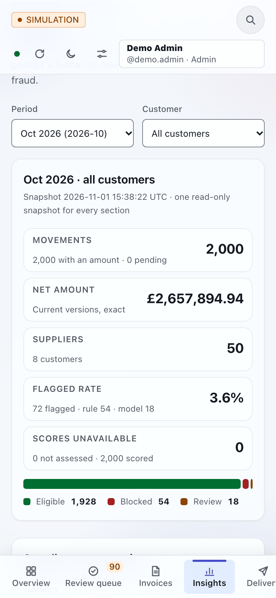<br><sub>Mobile: review queue and insights</sub>
</td>
</tr>
</table>

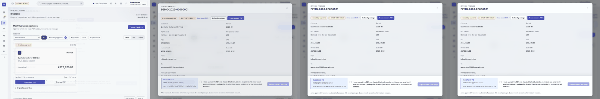<br>
<sub>Motion: the invoice package dialog opening, frame by frame.</sub>

**Invoice formats.** The same synthetic invoice rendered with the two shipped
template packs:

<table>
<tr>
<td width="50%" align="center">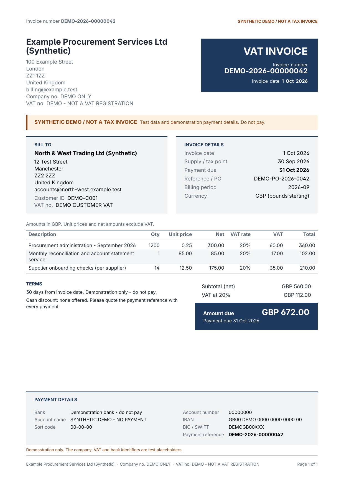<br><sub><code>uk-modern-v1</code> (default profile)</sub></td>
<td width="50%" align="center">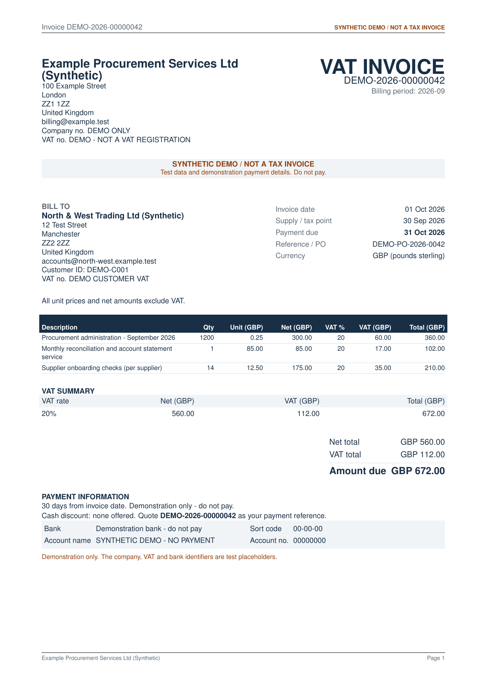<br><sub><code>uk-classic-v3</code> (legacy, byte-identical template)</sub></td>
</tr>
</table>

## 4. Architecture

A deeper, module-by-module explanation with more diagrams (module map, job
queue, locking, outbox and case lifecycles, render identity) is in
**[docs/ARCHITECTURE.md](docs/ARCHITECTURE.md)**.

### 4a. System components

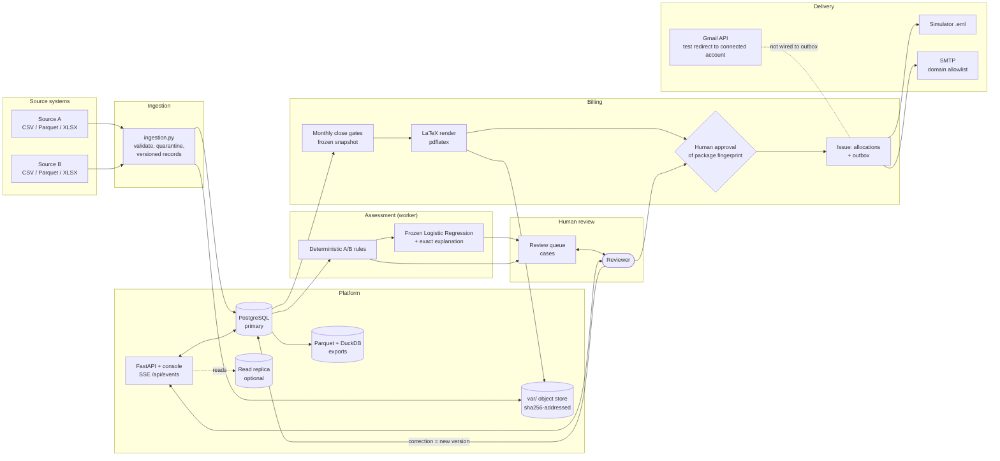
```mermaid
flowchart LR
    subgraph Sources["Source systems"]
        SA["Source A<br/>CSV / Parquet / XLSX"]
        SB["Source B<br/>CSV / Parquet / XLSX"]
    end
    subgraph Ingest["Ingestion"]
        ING["ingestion.py<br/>validate, quarantine,<br/>versioned records"]
    end
    subgraph Assess["Assessment (worker)"]
        RULES["Deterministic A/B rules"]
        LR["Frozen Logistic Regression<br/>+ exact explanation"]
    end
    subgraph Review["Human review"]
        Q["Review queue<br/>cases"]
        H(["Reviewer"])
    end
    subgraph Billing["Billing"]
        CLOSE["Monthly close gates<br/>frozen snapshot"]
        TEX["LaTeX render<br/>pdflatex"]
        APP{"Human approval<br/>of package fingerprint"}
        ISS["Issue: allocations<br/>+ outbox"]
    end
    subgraph Delivery
        SIM["Simulator .eml"]
        SMTP["SMTP<br/>domain allowlist"]
        GM["Gmail API<br/>test redirect to connected account"]
    end
    subgraph Platform
        API["FastAPI + console<br/>SSE /api/events"]
        PG[("PostgreSQL<br/>primary")]
        RR[("Read replica<br/>optional")]
        OBJ[("var/ object store<br/>sha256-addressed")]
        PQ[("Parquet + DuckDB<br/>exports")]
    end
    SA --> ING
    SB --> ING
    ING --> OBJ
    ING --> PG
    PG --> RULES --> LR --> Q
    RULES --> Q
    Q <--> H
    H -->|"correction = new version"| PG
    PG --> CLOSE --> TEX --> OBJ
    TEX --> APP
    H --> APP
    APP --> ISS --> SIM
    ISS --> SMTP
    GM -. "not wired to outbox" .- ISS
    API <--> PG
    API -. reads .-> RR
    API <--> H
    PG --> PQ
```

### 4b. One movement, from ingestion to a dispatched invoice

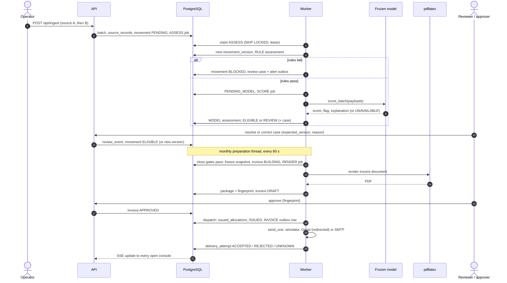
```mermaid
sequenceDiagram
    autonumber
    actor Op as Operator
    participant API as API
    participant DB as PostgreSQL
    participant W as Worker
    participant ML as Frozen model
    participant TeX as pdflatex
    actor Rev as Reviewer / approver
    Op->>API: POST /api/ingest (source A, then B)
    API->>DB: batch, source_records, movement PENDING, ASSESS job
    W->>DB: claim ASSESS (SKIP LOCKED, lease)
    W->>DB: new movement_version, RULE assessment
    alt rules fail
        W->>DB: movement BLOCKED, review case + alert outbox
    else rules pass
        W->>DB: PENDING_MODEL, SCORE job
        W->>ML: score_batch(payloads)
        ML-->>W: score, flag, explanation (or UNAVAILABLE)
        W->>DB: MODEL assessment, ELIGIBLE or REVIEW (+ case)
    end
    Rev->>API: resolve or correct case (expected_version, reason)
    API->>DB: review_event, movement ELIGIBLE (or new version)
    Note over W,DB: monthly preparation thread, every 60 s
    W->>DB: close gates pass: freeze snapshot, invoice BUILDING, RENDER job
    W->>TeX: render invoice document
    TeX-->>W: PDF
    W->>DB: package + fingerprint, invoice DRAFT
    Rev->>API: approve (fingerprint)
    API->>DB: invoice APPROVED
    W->>DB: dispatch: issued_allocations, ISSUED, INVOICE outbox row
    W->>W: send_one: simulator, Gmail (redirected) or SMTP
    W->>DB: delivery_attempt ACCEPTED / REJECTED / UNKNOWN
    DB-->>API: SSE update to every open console
```

### 4c. Main tables

Real table and column names from `src/invoice_optimizer/models.py` (key
columns only; full diagram in [ARCHITECTURE.md](docs/ARCHITECTURE.md#4-data-model)).

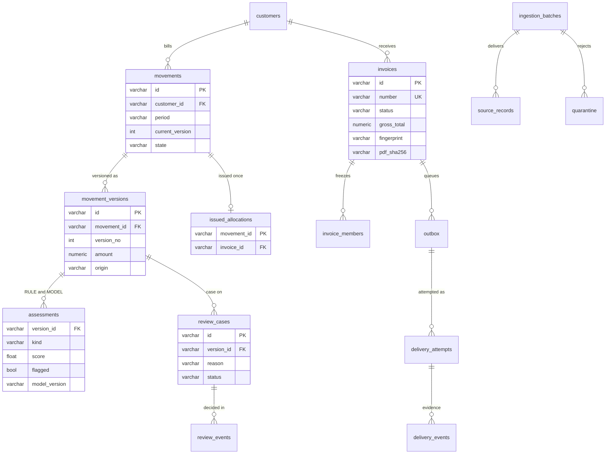
```mermaid
erDiagram
    customers ||--o{ movements : bills
    ingestion_batches ||--o{ source_records : delivers
    ingestion_batches ||--o{ quarantine : rejects
    movements ||--o{ movement_versions : "versioned as"
    movement_versions ||--o{ assessments : "RULE and MODEL"
    movement_versions ||--o{ review_cases : "case on"
    review_cases ||--o{ review_events : "decided in"
    customers ||--o{ invoices : receives
    invoices ||--o{ invoice_members : freezes
    movements ||--o| issued_allocations : "issued once"
    invoices ||--o{ outbox : queues
    outbox ||--o{ delivery_attempts : "attempted as"
    delivery_attempts ||--o{ delivery_events : evidence

    movements {
        varchar id PK
        varchar customer_id FK
        varchar period
        int current_version
        varchar state
    }
    movement_versions {
        varchar id PK
        varchar movement_id FK
        int version_no
        numeric amount
        varchar origin
    }
    assessments {
        varchar version_id FK
        varchar kind
        float score
        bool flagged
        varchar model_version
    }
    review_cases {
        varchar id PK
        varchar version_id FK
        varchar reason
        varchar status
    }
    invoices {
        varchar id PK
        varchar number UK
        varchar status
        numeric gross_total
        varchar fingerprint
        varchar pdf_sha256
    }
    issued_allocations {
        varchar movement_id PK
        varchar invoice_id FK
    }
```

### 4d. Lifecycles

Taken from the transitions in `assessment.py` and `billing.py`.

**Movement**

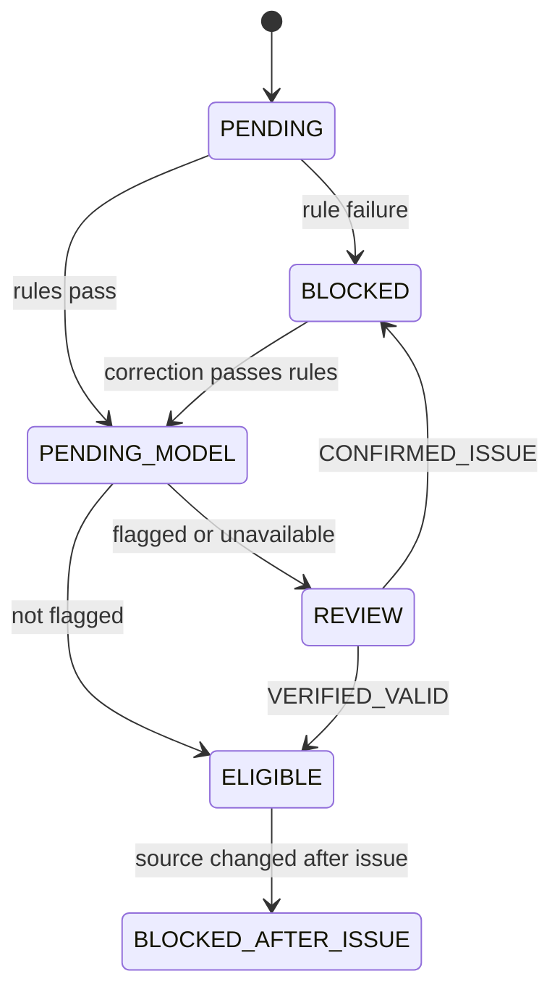
```mermaid
stateDiagram-v2
    [*] --> PENDING
    PENDING --> BLOCKED: rule failure
    PENDING --> PENDING_MODEL: rules pass
    PENDING_MODEL --> ELIGIBLE: not flagged
    PENDING_MODEL --> REVIEW: flagged or unavailable
    REVIEW --> ELIGIBLE: VERIFIED_VALID
    REVIEW --> BLOCKED: CONFIRMED_ISSUE
    BLOCKED --> PENDING_MODEL: correction passes rules
    ELIGIBLE --> BLOCKED_AFTER_ISSUE: source changed after issue
```

**Invoice**

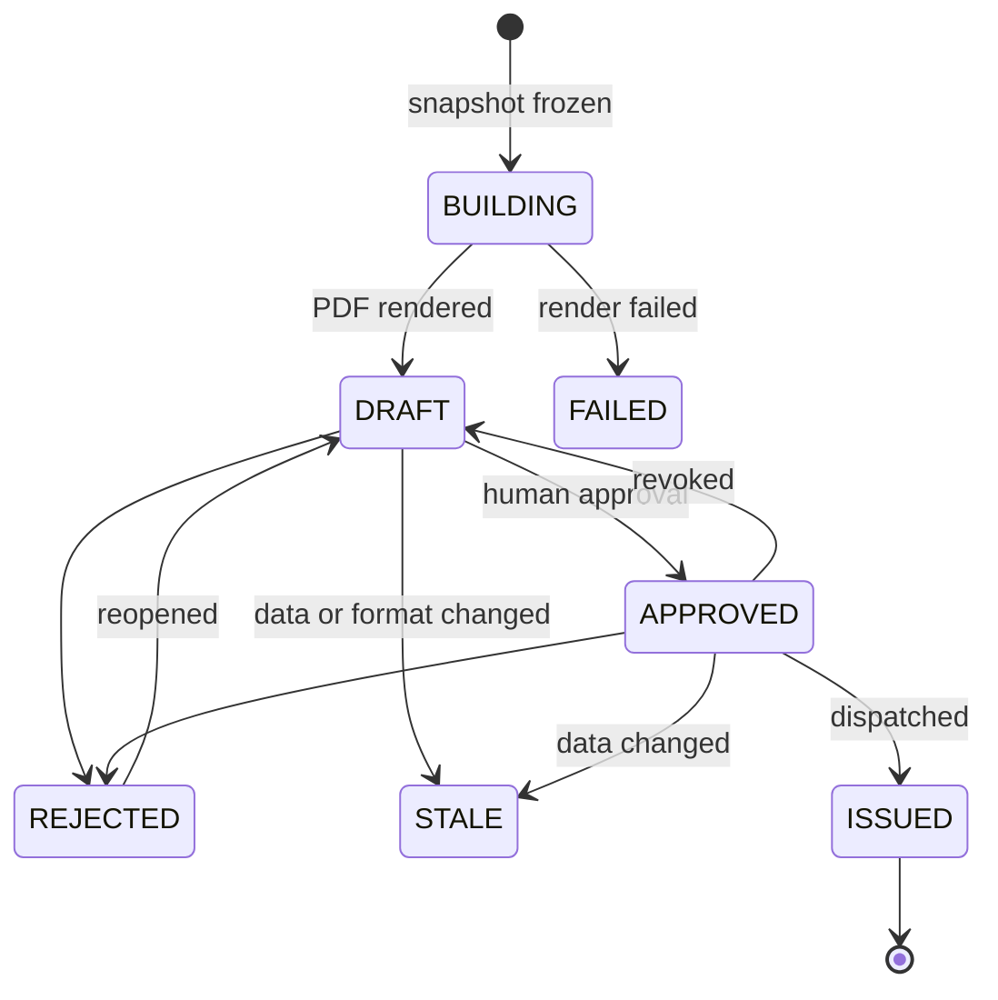
```mermaid
stateDiagram-v2
    [*] --> BUILDING: snapshot frozen
    BUILDING --> DRAFT: PDF rendered
    BUILDING --> FAILED: render failed
    DRAFT --> APPROVED: human approval
    APPROVED --> DRAFT: revoked
    DRAFT --> REJECTED
    APPROVED --> REJECTED
    REJECTED --> DRAFT: reopened
    DRAFT --> STALE: data or format changed
    APPROVED --> STALE: data changed
    APPROVED --> ISSUED: dispatched
    ISSUED --> [*]
```


Monthly close needs **every** movement of the customer-month in `ELIGIBLE`,
both sources' latest deliveries complete and count-verified, no unresolved
quarantine, no unfinished assessment jobs and no open case.

### 4e. Deployment (`compose.yaml`)

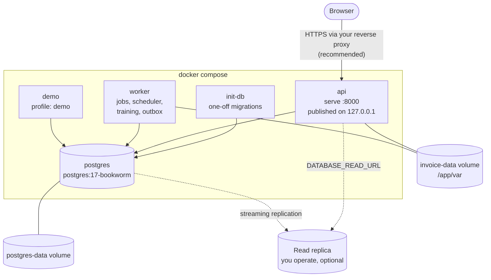
```mermaid
flowchart TB
    U(["Browser"]) -->|"HTTPS via your reverse proxy<br/>(recommended)"| API
    subgraph compose["docker compose"]
        INIT["init-db<br/>one-off migrations"]
        API["api<br/>serve :8000<br/>published on 127.0.0.1"]
        WK["worker<br/>jobs, scheduler,<br/>training, outbox"]
        PG[("postgres<br/>postgres:17-bookworm")]
        DEMO["demo<br/>profile: demo"]
    end
    VOL[("invoice-data volume<br/>/app/var")]
    PGV[("postgres-data volume")]
    RR[("Read replica<br/>you operate, optional")]
    INIT --> PG
    API --> PG
    WK --> PG
    DEMO --> PG
    PG --- PGV
    API --- VOL
    WK --- VOL
    API -. "DATABASE_READ_URL" .-> RR
    PG -. "streaming replication" .-> RR
```

The read replica is not part of `compose.yaml`; it is an option the
application supports through `DATABASE_READ_URL`.

| Component | Technology |
|---|---|
| API and console | FastAPI, uvicorn; vanilla JavaScript, CSS and HTML |
| Live updates | Server-Sent Events, one cached summary per API process, two-second check |
| Operational data | PostgreSQL 15+ (SQLAlchemy 2, psycopg 3) |
| Worker | Python process: database job queue with `SKIP LOCKED`, leases, claim tokens |
| Model | scikit-learn Logistic Regression, NumPy, joblib artifacts |
| Files | Local content-addressed object store under `INVOICE_DATA_DIR` |
| Analytics | PyArrow ZSTD Parquet, DuckDB verification |
| Invoices | Jinja2 + LaTeX (`pdflatex`), Poppler for page previews |

## 5. Quick start

### Native (macOS or Linux)

Needs Python 3.11+, PostgreSQL 15+ binaries, `pdflatex`, Poppler and
`rg` (used by the cluster helper). Nothing touches a system database: the
helper creates a project cluster in `var/postgres` on port 55432.

```bash
python3 -m venv .venv
.venv/bin/python -m pip install -r requirements.lock.txt
.venv/bin/python -m pip install --no-deps -e .
.venv/bin/python scripts/bootstrap.py        # generates .env (0600): DB password, API token, setup token
bash scripts/local_postgres.sh               # INVOICE_PG_BIN overrides the PostgreSQL bin directory
.venv/bin/python -m invoice_optimizer init-db
.venv/bin/python -m invoice_optimizer demo --customers 8 --movements 2000
.venv/bin/python scripts/run_local.py        # API + worker
```

Open **http://127.0.0.1:8765** and create the first administrator with the
`INVOICE_SETUP_TOKEN` value from your `.env`. The demo loads 8 synthetic
customers and 2,000 movements with deliberate exceptions, trains the model and
prepares an unapproved invoice for `C0001`. No real email is sent.

- Logs: `var/api.log`, `var/worker.log`. Ctrl-C stops the API and worker;
  stop the database with `bash scripts/local_postgres.sh stop`.
- With an existing PostgreSQL server: set `DATABASE_URL` and use
  `scripts/run_local.py --skip-postgres-start`.
- More synthetic months: `scripts/seed_invoice_examples.py ingest`
  (see [OPERATIONS.md](docs/OPERATIONS.md#additional-source-only-examples)).

### Docker Compose

```bash
.venv/bin/python scripts/bootstrap.py
docker compose up --build -d
docker compose --profile demo run --rm demo
```

The console is on **http://127.0.0.1:8000**. Compose was validated but image
builds and container runs were not executed during development.

<details>
<summary><b>All CLI commands</b> (<code>invoice-optimizer --help</code>)</summary>

Run as `invoice-optimizer <command>` or `.venv/bin/python -m invoice_optimizer <command>`.

| Command | Purpose |
|---|---|
| `init-db` | Create or upgrade the schema (migrations 1-8, idempotent) |
| `serve [--host] [--port]` | Run the API and console (default `127.0.0.1:8000`) |
| `worker` | Run the background worker |
| `tick` | Process one bounded batch of jobs and outbox rows |
| `demo` | Generate synthetic data, train, ingest, prepare a demo invoice |
| `generate --output DIR` | Generate synthetic source files only |
| `benchmark` | Measured pipeline run in a disposable schema |
| `train FILE` | Train and activate a model from a training Parquet file |
| `train-synthetic --request-id ID [--rows] [--seed] [--period]` | Queue an auditable synthetic training run |
| `load-customers FILE` | Load customers from JSON |
| `ingest FILE --source A\|B --period YYYY-MM [--expected-rows N] [--complete] [--sheet NAME]` | Ingest a source delivery |
| `close --customer ID --period YYYY-MM --request-id ID` | Prepare an invoice for one customer-month |
| `export --period YYYY-MM [--output DIR]` | Verified Parquet export |
| `insights --period YYYY-MM [--customer] [--limit] [--json PATH]` | Read-only statistical report |
| `operator-create --username U --display-name N [--role admin\|reviewer]` | Create a personal account (password prompted) |
| `maintenance [--prune-done-jobs-older-than DAYS] [--prune-commands-older-than DAYS] [--apply]` | Retention (dry run by default) and VACUUM/ANALYZE hints |
| `format list` | Installed packs and profiles with status |
| `format validate PROFILE` | Validate a profile and print its resolved form |
| `format preview --profile P --out DIR [--itemized]` | Render a synthetic sample PDF (and PNG) |
| `inbox-scan` | Ingest settled deliveries from `var/inbox` once (the worker does this automatically) |
| `automation-status` | Next month-end run, last automation reports, mail readiness |

`demo`, `generate` and `benchmark` accept `--customers`, `--movements`,
`--seed`, `--period` and `--largest-customer-movements`. `demo` also accepts
`--scenario-profile` (`model-evidence` by default, so every review case has a
logistic-regression score; `full` adds missing-feature and quarantine cases,
`model-only` keeps only model-flagged cases). The pipeline itself still treats a
missing score as unknown, never as zero.

</details>

## 6. Company adoption guide

The full guide is **[docs/ADOPTION.md](docs/ADOPTION.md)**: adoption path,
topologies, every environment variable, data onboarding, hardening, scaling,
backups, monitoring and upgrades. The essentials:

**Prerequisites.** Python 3.11+, PostgreSQL 15+, `pdflatex`, Poppler; Docker
optional. A reverse proxy for HTTPS if more than one person will use it.

**Topologies.** (1) One host, native processes via `scripts/run_local.py`.
(2) Docker Compose: `postgres`, one-off `init-db`, `api`, `worker`, optional
`demo`. (3) Either one behind an HTTPS reverse proxy. (4) Add a read replica
with `DATABASE_READ_URL`. (5) More worker processes: claims use `SKIP LOCKED`,
and all processes must share `INVOICE_DATA_DIR`.

**First administrator.** Sign in with the one-time `INVOICE_SETUP_TOKEN`
(rejected once any operator exists), or run
`invoice-optimizer operator-create --username U --display-name N --role admin`. Create a personal account for
every reviewer in **Team access**. The shared `INVOICE_API_TOKEN` is read-only.

**Real data.** Convert each system's monthly export to the source contract
(`record_id, revision, movement_id, customer_id, event_at, period, currency,
amount, description, supplier_id`, plus optional model features), load
customers with `load-customers`, then `ingest --complete --expected-rows N`
for source A and B. See [ADOPTION.md section 6](docs/ADOPTION.md#6-connecting-your-data-sources).

**Seller identity and branding.** Copy `config/invoice_profiles/default.toml`,
set your `[seller]` block, colours and logo, validate, preview, then set
`INVOICE_FORMAT_PROFILE` ([section 7](#7-customising-the-invoice-format)).

**Email.** Default is the simulator. SMTP: `INVOICE_PROVIDER=smtp`,
`SMTP_HOST`, `SMTP_PORT`, `SMTP_USER`, `SMTP_PASSWORD`, and a narrow
`INVOICE_ALLOWED_EMAIL_DOMAINS`. Gmail: `INVOICE_PROVIDER=gmail`, then connect
the account in the Email tab ([GMAIL_SETUP.md](docs/GMAIL_SETUP.md)). In this
synthetic release every real message is redirected to the connected account
(`INVOICE_MAIL_REDIRECT=connected`); invoices still go out only after approval.

**Automation.** `scripts/run_local.py` refreshes data on its own (an inbox in
`var/inbox/` polled every 30 s, plus a synthetic demo feed every 15 minutes),
prepares DRAFT invoices from 00:00 Europe/London on the 1st, emails an
"invoices await approval" reminder, and sends each invoice seconds after a person
approves it (with Gmail selected, only once the account is connected; until then
approved invoices wait and nothing is issued). `GET /api/automation/status` shows the next run and last reports
([OPERATIONS.md](docs/OPERATIONS.md#automatic-refresh-and-month-end-automation)).

<details>
<summary><b>Environment variables</b> (all of <code>config.py</code>)</summary>

| Variable | Default | Meaning |
|---|---|---|
| `DATABASE_URL` | `postgresql+psycopg://invoice@127.0.0.1:55432/invoice_optimizer` | Primary database (PostgreSQL only; no default password) |
| `DATABASE_READ_URL` | empty | Optional replica for lists, exports and insights |
| `INVOICE_API_TOKEN` | empty | Shared read-only token, at least 32 characters (API refuses to start otherwise) |
| `INVOICE_SETUP_TOKEN` | empty | One-time first-admin secret, at least 32 characters, different from the API token |
| `INVOICE_DATA_DIR` | `var` | Object store, documents, model, mail, exports, session key |
| `INVOICE_ACTOR` | `local-reviewer` | Actor label for CLI audit events |
| `INVOICE_SYNTHETIC` | `1` | Must be `1` in this release |
| `INVOICE_PROVIDER` | `simulated` | `simulated`, `gmail` or `smtp` |
| `INVOICE_MAIL_REDIRECT` | `connected` | Test redirect for real mail: `connected`, one allowed address; `off` refused in synthetic mode |
| `INVOICE_MAIL_SEND_KINDS` | `INVOICE,DIGEST,TEST` | Outbox kinds a real provider sends; others stay simulated |
| `INVOICE_OPERATOR_EMAIL` | `operations@example.test` | Recipient of approval reminders and test messages (before redirect) |
| `INVOICE_APPROVAL_DIGEST` | `1` | Daily approval reminder while DRAFT invoices wait |
| `INVOICE_INBOX_SECONDS` | `30` | Inbox polling interval (0 disables; 5-3600) |
| `INVOICE_INBOX_MAX_FILES` | `4` | Deliveries ingested per inbox cycle (1-50) |
| `INVOICE_DEMO_FEED_SECONDS` | `0` (`900` in `run_local`) | Synthetic feed interval (0 disables; 60-86400) |
| `INVOICE_DEMO_FEED_ROWS` | `300` | Synthetic movements per feed month |
| `INVOICE_AUTO_CLOSE` | `1` | Initial default for automatic monthly preparation |
| `INVOICE_AUTO_DISPATCH` | `1` | Initial default for queueing approved invoices |
| `INVOICE_BATCH_SIZE` | `1000` | Ingestion chunk size (1-10000) |
| `INVOICE_WORKER_BATCH_SIZE` | `500` | Movements per assessment job (1-10000) |
| `INVOICE_POLL_SECONDS` | `2` | Worker idle sleep and SSE interval (0.1-60) |
| `INVOICE_TEX_COMPILER` | `pdflatex` | LaTeX executable |
| `INVOICE_FORMAT_PROFILE` | `default` | Profile for newly frozen drafts |
| `INVOICE_PROFILE_DIR` | `config/invoice_profiles` | Profile directory (logos in `assets/`) |
| `INVOICE_PUBLIC_BASE_URL` | `http://127.0.0.1:8765` | Public origin; HTTPS or loopback HTTP only; HTTPS enables Secure cookies and HSTS |
| `INVOICE_SECURE_COOKIES` | `0` | `1` forces Secure cookies on loopback HTTP |
| `INVOICE_GMAIL_EXPECTED_EMAIL` | empty | Google account the OAuth connection must match |
| `INVOICE_ALLOWED_EMAIL_DOMAINS` | `example.test` | SMTP recipient domain allowlist (comma-separated) |
| `SMTP_HOST` | empty | Required for `smtp` |
| `SMTP_PORT` | `587` | STARTTLS port |
| `SMTP_USER`, `SMTP_PASSWORD` | empty | Optional SMTP login |
| `INVOICE_DB_POOL_SIZE` | `4` | Pool size per process (1-200) |
| `INVOICE_DB_MAX_OVERFLOW` | `2` | Overflow per process (0-200) |
| `INVOICE_DB_POOL_RECYCLE_SECONDS` | `1800` | Connection recycle (-1 to 86400) |
| `INVOICE_DB_STATEMENT_TIMEOUT_MS` | `0` | API only; 0 disables |
| `INVOICE_DB_LOCK_TIMEOUT_MS` | `0` | API only; also bounds advisory-lock waits |
| `INVOICE_DB_IDLE_TX_TIMEOUT_MS` | `0` | API only; must exceed slow CSV download pauses |

Scripts also read `POSTGRES_PASSWORD`, `INVOICE_PG_BIN`, `INVOICE_PG_PORT`,
`INVOICE_DB_PASSWORD`, `INVOICE_DOCKER_PUBLIC_BASE_URL` and (tests)
`TEST_DATABASE_URL`. Details in [ADOPTION.md](docs/ADOPTION.md#4-configuration-reference).

</details>

**Security hardening checklist** (details in
[ADOPTION.md section 9](docs/ADOPTION.md#9-security-hardening-checklist)):

- [ ] HTTPS in front of the API, `INVOICE_PUBLIC_BASE_URL=https://...`
- [ ] Secrets generated by `scripts/bootstrap.py`; `.env` and `var/private/` kept private
- [ ] One personal account per person; separate `INVOICE_SETUP_TOKEN`
- [ ] Least-privilege database roles: owner for `init-db`, DML-only role for API/worker, `SELECT`-only for the replica (recommended, not tested)
- [ ] PostgreSQL reachable only from application hosts
- [ ] Narrow `INVOICE_ALLOWED_EMAIL_DOMAINS`
- [ ] Encrypted, restore-tested backups of the database **and** `INVOICE_DATA_DIR`
- [ ] API timeouts set once you know your slowest legitimate query

**Scaling for huge databases.** Built in: streaming ingestion, bounded jobs,
partial and BRIN indexes (migration 8), keyset pagination
(`cursor=` on cases, invoices, outbox, audit), read replica routing, API
timeouts returning `503` + `Retry-After`, intake back-pressure (`429`), and
`maintenance` retention. Partitioning and parallel per-customer close are
designed but **not implemented**
([PERFORMANCE.md](docs/PERFORMANCE.md#next-steps-deliberately-not-done)).
On a large live database, create migration 8's indexes `CONCURRENTLY` before
running `init-db`.

**Backup and restore.** Stop the API, worker and CLI writers; `pg_dump` the
database; archive `objects/`, `documents/`, `model/` and `mail/` from
`INVOICE_DATA_DIR`; record code and model hashes. Restore into a new database
and data directory with automation and transport off. Full runbook:
[OPERATIONS.md](docs/OPERATIONS.md#coherent-backup).

**Monitoring.** `GET /health` (unauthenticated liveness plus a database round
trip), the worker heartbeat in **Data & model**, job and outbox counts on the
dashboard, `pg_stat_activity.application_name` (`invoice-optimizer-api`,
`-worker`, `-cli`), and `var/*.log`. No metrics exporter is included.

**Upgrades.** Back up, stop API and worker, install the new code, run
`invoice-optimizer init-db`, start again. Migrations are numbered in
`schema_migrations` and run in one transaction under an advisory lock.

## 7. Customising the invoice format

An invoice's look comes from two pieces:

| Piece | Where | Who changes it |
|---|---|---|
| **Profile** (company data) | `config/invoice_profiles/<id>.toml` | Finance or operations. Validated field by field; can never contain TeX. |
| **Template pack** (layout) | `src/invoice_optimizer/templates/packs/<pack>/` (`pack.toml`, `invoice.tex.j2`) | Developers, through code review. Pinned by SHA-256 in `formats.PINNED_PACKS`; a pack whose files no longer match its pin is refused. |

Shipped: `uk-modern-v1` (default; A4 or US Letter, accent header, cards,
totals panel, optional logo and IBAN/BIC) and `uk-classic-v3` (the original
layout; only the `[seller]` block applies).

**Change the format in six steps**

```bash
# 1. copy a profile (ids: 1-64 chars of a-z 0-9 - _, starting with a letter or digit)
cp config/invoice_profiles/default.toml config/invoice_profiles/acme.toml
#    edit [seller], [colors] (each needs >= 4.5:1 contrast on white), font, paper,
#    margins_mm, date_format, [labels], [columns], [payment], logo (assets/, <= 512 KB)

# 2. validate: prints profile_sha256 and asset hashes, exit 1 with the reason on error
.venv/bin/python -m invoice_optimizer format validate acme

# 3. preview: synthetic sample, nothing written to the database
.venv/bin/python -m invoice_optimizer format preview --profile acme --out var/preview --itemized
#    -> var/preview/acme-preview.pdf (+ acme-preview.png when pdftoppm is installed)

# 4. activate for every process that freezes invoices (API, worker, CLI)
export INVOICE_FORMAT_PROFILE=acme

# 5. restart the API and the worker (an invalid profile id stops start-up)
# 6. optional: regenerate an unapproved draft with POST /api/invoices/{id}/format
```

**What changes, and when.** Only drafts frozen after the restart use the new
profile. At freeze time the resolved profile, pack hash and logo hash are
copied into the invoice document and the logo bytes go into the object store.
Existing drafts, approved and issued invoices never change, even if the
profile file is edited or deleted. Regenerating a draft makes the old one
`STALE` (its PDF is kept) and the new one needs its own approval.

**Content addressing and the legacy pack.** Each render has an identity hash:
legacy documents (no `presentation` block) use
`sha256("uk-a4-v3-movement-vat:" + document_sha256 + ":" + template_sha256)`;
profile documents use `sha256("v2:" + renderer_version + ":" + document_sha256 + ":" + pack_sha256 + ":" + sha256(assets))`.
The legacy template `templates/uk_invoice.tex.j2` is kept **byte-identical**
and pinned (`template_sha256`), so every PDF produced before profiles existed
still re-verifies against its recorded identity. Changing a pack therefore
always means shipping a **new pack ID** with a new `renderer_version`.

**New template pack, step by step:** copy `uk-modern-v1` to a new ID, set
`pack.toml`, edit `invoice.tex.j2` (every data value through the `tex` /
`texdetail` filters), add the pin from `formats.pack_digest('<id>')` to
`PINNED_PACKS`, add real-pdfLaTeX tests (VAT, non-VAT, multi-page, itemised),
run `format preview`, then point a profile at it. Full field reference and the
HMRC content checklist: **[docs/INVOICE_FORMATS.md](docs/INVOICE_FORMATS.md)**.

## 8. Insights and data intelligence

Read-only statistical signals for a reviewer. None of them changes data, and
none is a finding of error or fraud.

| Insight | Method |
|---|---|
| `overview` | Counts, net by currency, state mix, flagged rate, score availability, top quarantine reasons |
| `supplier_concentration` | Supplier shares and Herfindahl-Hirschman index per customer, `10000 * sum(share^2)`; > 2500 highly concentrated |
| `duplicate_candidates` | Same customer, supplier, currency and exact amount within `window_days` (default 7), via `LAG()` |
| `amount_outliers` | Modified z-score `0.6745 * (x - median) / MAD` per supplier and currency, `|z| > 3.5`, n >= 10 |
| `benford` | First-digit chi-square (df 8) and Nigrini MAD bands; needs n >= 300 |
| `trends` | 12 periods, zero-filled, percent change and top movers |
| `risk_distribution` | 10-bin score histogram, p50/p90/p99; NULL scores never binned |
| `review_ageing` | Open cases by age bucket, severity and reason |
| `data_quality` | Missing optional fields, A/B mismatch reasons, quarantine by source |

- **Consistency:** each call is one `REPEATABLE READ READ ONLY` snapshot; the
  report computes every section inside the same snapshot. Money stays exact
  `Decimal`.
- **API:** `GET /api/insights/periods`, `GET /api/insights/report`,
  `GET /api/insights/{overview|suppliers|duplicates|outliers|benford|trends|risk|ageing|quality}`.
  Served from the read engine, cached 30 s per process, at most two
  computations at a time.
- **CLI:** `invoice-optimizer insights --period 2026-09 [--customer C0001] [--json report.json]`
  (atomic write).
- **Offline history:** `invoice-optimizer export --period YYYY-MM` writes
  ZSTD Parquet with exact decimals, verified against the SQL snapshot with
  DuckDB; `insights.insights_from_parquet()` computes concentration,
  duplicates, Benford and trends over many exported months without touching
  PostgreSQL.

Details: [INSIGHTS.md](docs/INSIGHTS.md), [ANALYTICS.md](docs/ANALYTICS.md),
model: [ML_MODEL.md](docs/ML_MODEL.md).

## 9. UI and design system

The console is one HTML page with vanilla JavaScript and CSS: no framework, no
build step, no CDN, no web fonts, no analytics. Full specification:
**[docs/UI_DESIGN.md](docs/UI_DESIGN.md)**.

- **Tokens** (`static/tokens.css`): every colour derives from OKLCH primitives.
  Six accent presets (indigo default, blue, teal, emerald, amber, rose) change
  only hue, chroma and lightness numbers. sRGB fallbacks for engines without
  `oklch()`.
- **Themes and surfaces** (`static/theme.js`, loaded first): light, dark or
  system; glass (`backdrop-filter`, chosen by default only when supported and
  `prefers-reduced-transparency` is not set) or solid; comfortable or compact
  density; collapsible sidebar. Preferences live in `localStorage` (`io.*`)
  and never include data or credentials.
- **Motion** (`static/motion.js` and duration tokens): view entrance, KPI
  count-up, sliding segmented-control indicator, view transitions on theme
  change. Reduced motion (OS setting or the Motion preference) sets every
  duration token to 0.
- **Charts** (`static/charts.js`): sparkline, bar, stacked bar, donut,
  histogram, paired bars, funnel and an area trend chart (gradient fill,
  right-hand axis with a value pill, hover crosshair, 3M/6M/12M/All range), as
  inline SVG with a text summary, a hidden data table and a keyboard-navigable
  tooltip.
- **Market layer** (`static/market.css`, loaded last): the trading-platform
  look. Shared green-up/red-down colours always paired with ▲/▼ or a minus
  sign, tabular digits, flat cards, uppercase KPI labels, a three-band bar
  next to each risk score, and a three-tone dark theme with border lines. A
  missing model score stays a grey "Unavailable", never 0.
- **Command palette** (`static/shortcuts.js`): 720 px wide (window minus
  32 px at most), a floating panel with an 8 px gutter on phones, filter pills
  (All, Pages, Records, Actions, Settings; `Tab` cycles them), grouped results
  with a second line (movement ID, amount) and highlighted matches. Typing a
  movement ID such as `MOV-2026…` offers "Find movement".

<details>
<summary><b>Keyboard map</b> (<code>static/shortcuts.js</code>)</summary>

| Keys | Action |
|---|---|
| `Cmd K` / `Ctrl K` | Open or close the command palette |
| `/` | Focus case search |
| `?` | Show keyboard shortcuts |
| `g` then `o` `r` `i` `n` `d` `m` `e` `t` | Go to Overview, Review queue, Invoices, Insights, Delivery, Data & model, Email setup, Team access |
| `j` / `k` | Next / previous record row |
| `Enter` | Open the focused record |
| `x` | Select the focused case for release |
| `r` | Refresh the current view |
| `Shift T` | Cycle theme: system, light, dark |
| `Shift D` | Toggle density |
| `[` | Collapse or expand the sidebar |
| Arrow keys, `Home`, `End`, `Esc` | Move through chart points / close the tooltip |

Shortcuts are ignored while typing in a field or while a dialog is open.

</details>

**Accessibility.** Skip link, landmark navigation, native dialogs, labelled
forms, visible focus, status shown as dot plus text (never colour alone),
screen-reader announcements for view changes and live updates, chart data
tables, a 24 px minimum target token, `forced-colors` rules. During the
redesign a contrast script checked 342 text and fill pairs across both themes,
all six accents and glass worst cases at WCAG AA 4.5:1; all passed (the script
is not part of this repository).

**Research behind it.** 126 public product and documentation pages
(invoicing/AP-AR, operations SaaS dashboards, design systems) were measured
automatically. Medians: 16 px body text, line-height 1.5, 40 px primary
buttons, 72 px headers, 1316 px content width; 86 of 126 had
`prefers-reduced-motion` rules but only 5 showed a Cmd-K pattern and 43 a
skip link. The console deliberately runs denser (14 px body, 32 px controls)
for an all-day work tool. See [UI_DESIGN.md](docs/UI_DESIGN.md#design-research-126-sites).

## 10. Performance and scale evidence

Numbers below are single local runs recorded in
[PERFORMANCE.md](docs/PERFORMANCE.md). They are evidence for those runs, not
throughput guarantees.

**Bounded pipeline** (200 customers, 20,000 movements, 10,000 for the largest
customer, seed 42, after migration 8):

| Stage | Time |
|---|---:|
| Source A / B ingestion | 4.229 s / 4.059 s |
| Reconciliation, scoring and evidence | 12.866 s |
| Verified Parquet export | 1.199 s |
| Entire run | 23.272 s |

**Concurrent ingestion with live readers** (100,000 movements, 50,000 for the
largest customer, two worker threads, two HTTP readers and one SSE reader;
141.026 s measured interval; all 2,035 requests succeeded; 248.16 MiB peak
Python RSS excluding PostgreSQL):

| Endpoint | p95 | p99 | Max |
|---|---:|---:|---:|
| Dashboard | 74.664 ms | 119.373 ms | 170.286 ms |
| Review cases | 146.423 ms | 207.248 ms | 1129.143 ms |
| Invoice list | 51.946 ms | 103.282 ms | 127.871 ms |
| Version history | 120.804 ms | 174.442 ms | 188.359 ms |

> [!WARNING]
> A two-million-movement run has **not** been executed. To measure it on your
> hardware (needs substantial disk and time):
>
> ```bash
> .venv/bin/python -m invoice_optimizer benchmark --customers 200 --movements 2100000 \
>   --largest-customer-movements 2000000 --period 2026-09 --seed 42
> ```
>
> It runs in a disposable schema and never touches the live one. Do not
> extrapolate the smaller runs.

## 11. Testing and verification

```bash
# Python suite: integration tests on disposable PostgreSQL schemas, real pdflatex
export TEST_DATABASE_URL=postgresql+psycopg://invoice:<password>@127.0.0.1:55432/invoice_optimizer
.venv/bin/pytest -q
```

823 tests pass in 44 test files (the full run takes several minutes). They
never reset the application schema.

- `scripts/verify_local.py`: read-only consistency receipt for the running
  local dataset (counters vs SQL, retained-source hashes, invoice membership).
- `scripts/verify_*_ui.cjs`: browser fixture runners with every network call
  intercepted. They need Node and Playwright with Chromium
  (`NODE_PATH` pointing at a Playwright install), e.g.
  `node scripts/verify_operations_ui.cjs`. `*_live.cjs` variants run against a
  local server.
- `scripts/verify_streaming_workload.py`: isolated concurrent
  ingestion-plus-readers harness ([STREAMING_VERIFICATION.md](docs/STREAMING_VERIFICATION.md)).
- `invoice-optimizer format validate` / `format preview`: profile and pack
  checks without a database.

Acceptance evidence index: [VALIDATION.md](docs/VALIDATION.md).

## 12. Project layout

```text
.
├── README.md
├── compose.yaml · Dockerfile · .dockerignore
├── pyproject.toml · requirements.lock.txt
├── .env.example                  # template; real .env is generated, never committed
├── config/
│   └── invoice_profiles/         # default.toml, classic.toml, assets/ (logos)
├── docs/
│   ├── ARCHITECTURE.md · ADOPTION.md · INVOICE_FORMATS.md · INSIGHTS.md
│   ├── OPERATIONS.md · PERFORMANCE.md · UI_DESIGN.md · ML_MODEL.md · ANALYTICS.md
│   ├── GMAIL_SETUP.md · UK_INVOICE_FORMAT.md · IMPLEMENTATION_CONTRACT.md
│   ├── STREAMING_VERIFICATION.md · VALIDATION.md
│   └── assets/                   # invoice samples, ui/ screenshots
├── scripts/
│   ├── bootstrap.py · local_postgres.sh · run_local.py
│   ├── seed_invoice_examples.py · verify_*.py
│   └── verify_*_ui.cjs · verify_*_live.cjs     # Playwright runners
├── src/invoice_optimizer/
│   ├── cli.py · __main__.py · config.py · db.py · models.py · storage.py
│   ├── api.py · gmail_routes.py · worker.py · scheduler.py · inbox.py
│   ├── ingestion.py · assessment.py · billing.py · delivery.py · operations.py
│   ├── features.py · ml.py · model_ops.py · synthetic.py · benchmark.py
│   ├── formats.py · documents.py · movement_vat.py · invoice_preview.py
│   ├── insights.py · analytics.py · maintenance.py · provenance.py
│   ├── operators.py · auth_secrets.py · gmail.py · triage.py
│   ├── review_history.py · review_versions.py · review_cards.py
│   ├── review_card_drivers.py · review_import.py · bulk_review.py · risk_explanations.py
│   ├── static/                   # app.js, tokens.css, app.css, market.css, theme.js, charts.js, shortcuts.js, motion.js, ...
│   └── templates/                # index.html, uk_invoice.tex.j2, packs/uk-modern-v1, packs/uk-classic-v3
├── tests/                        # 44 pytest modules + conftest.py
└── output/                       # curated diagrams, mermaid sources, sample PDFs
```

Runtime data lives in `var/` (git-ignored): database cluster, object store,
documents, model, mail, logs.

## 13. Invariants and guarantees

These are enforced in code and covered by tests (for example
`tests/test_invariants.py`, `tests/test_audit_integrity.py`):

- **Exact money.** Amounts are `Decimal` / `NUMERIC(20,2)` end to end; never
  binary floats.
- **Retained sources.** Original files are stored by SHA-256 and verified on
  read; corrections create new versions, never edits.
- **Rules beat the model.** A deterministic failure cannot be cleared by
  review; only a `MODEL_RISK` concern with complete evidence can be released.
- **Unavailable is not zero.** A missing or failed score is `NULL` with status
  `UNAVAILABLE`.
- **Complete months only.** Close needs both latest deliveries complete and
  count-verified, no quarantine, no unfinished jobs, no open cases, every
  movement `ELIGIBLE`.
- **Approval is exact.** Approval binds to the package fingerprint; a
  mismatched fingerprint is refused, and new source data makes an unissued
  draft or approval `STALE`, so it needs a new approval. No auto-approval
  exists.
- **Bill once.** `issued_allocations.movement_id` is a primary key: a movement
  can be issued on one invoice only.
- **No truncation.** Itemised invoices above 10,000 movements are refused, not
  cut.
- **Uncertain stays uncertain.** An ambiguous email submission is `UNKNOWN`
  and is never retried automatically.
- **Append-only evidence.** `audit_events` and `review_events` reject
  `UPDATE`, `DELETE` and `TRUNCATE` (a database owner can still disable
  triggers; this is an application control, not tamper-proof archival).
- **Idempotent commands.** Every state change carries a request ID; a retry
  returns the recorded response.
- **Attributed decisions.** Changes require a personal account; the shared
  token is read-only.

## 14. Limitations and roadmap

Honest status of this release:

- **Synthetic data contract.** The two real source schemas, the commercial
  relationship and the VAT treatment are not yet defined. GBP only, fixed 20%
  VAT, `DEMO-` numbering, synthetic banner, start-up gate on
  `INVOICE_SYNTHETIC=1`.
- **No credit/debit notes.** Issued invoices cannot be adjusted.
- **Gmail** sends in test mode only (redirected to the connected account); a
  real Google send needs the owner's OAuth client and consent. SMTP has not
  been exercised against a real server.
- **Month boundary.** Periods are UTC months but month-end preparation starts
  at 00:00 London; in summer a draft can be prepared before the final demo-feed
  snapshot, which then marks it STALE so it is prepared (and approved) again.
- **Model** trained and evaluated on synthetic data only; its metrics say
  nothing about real-world accuracy.
- **Partitioning not implemented**; the period-wide freeze lock and the
  exclusive customer-period lock in workers have **not** been redesigned.
- **Two-million-movement benchmark not run.**
- **Docker** images were not built or run during development.
- **Not included:** OIDC/SSO, shared object storage for multi-host setups,
  provider webhooks, a metrics exporter, a tested full restore.

Roadmap candidates, in the order the code suggests: real source and tax
adapters, credit notes, unredirected live delivery, the 2M benchmark,
then partitioning and the shared-lock redesign
([PERFORMANCE.md](docs/PERFORMANCE.md#next-steps-deliberately-not-done)).

## 15. Security and contributing

- Report vulnerabilities privately as described in [SECURITY.md](SECURITY.md).
  Do not open public issues for security problems.
- Contribution rules are in [CONTRIBUTING.md](CONTRIBUTING.md).

## 16. License

**Proprietary, all rights reserved.** This repository is published for
viewing only; it is not open source. Using, running, copying, modifying or
deploying it, including internal use inside a company, requires a separate
written agreement with the copyright holder. See [LICENSE](LICENSE) for the
full terms.
